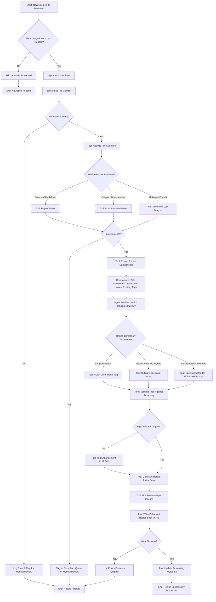

# Sage Agent Processing Flowchart

## Overview
This flowchart shows how the Sage agent orchestrates recipe processing using MCP servers. The agent is a simple while loop that routes messages between user, model, and MCP tools.



## Agent State Management

### Initial State
```python
{
    "file_path": "/path/to/recipe.md",
    "original_content": "...",
    "processing_stage": "initialized",
    "components": {},
    "tags": [],
    "errors": [],
    "metadata": {}
}
```

### Progressive State Updates
```python
# After file read
state["processing_stage"] = "content_loaded"
state["file_stats"] = {"size": 1024, "modified": "2025-01-09"}

# After structure analysis
state["processing_stage"] = "structure_analyzed"
state["format_type"] = "standard_markdown"
state["complexity_score"] = 3

# After component extraction
state["processing_stage"] = "components_extracted"
state["components"] = {
    "title": "Cashew Alfredo",
    "ingredients": [...],
    "instructions": [...],
    "prep_time": 15
}

# After tagging
state["processing_stage"] = "tagged"
state["tags"] = ["vegan", "italian", "quick", "creamy"]
```

## Tool Definitions

### Core File Tools
```python
tools = [
    {
        "name": "read_file",
        "description": "Read recipe file content and metadata",
        "parameters": {"file_path": "string"}
    },
    {
        "name": "write_enhanced_recipe", 
        "description": "Write recipe back with enhanced frontmatter",
        "parameters": {"file_path": "string", "content": "string", "backup": "boolean"}
    }
]
```

### Analysis Tools
```python
tools = [
    {
        "name": "analyze_structure",
        "description": "Determine recipe format and complexity",
        "parameters": {"content": "string"}
    },
    {
        "name": "extract_components",
        "description": "Parse ingredients, instructions, metadata",
        "parameters": {"content": "string", "format_hint": "string"}
    }
]
```

### Parsing Strategy Tools
```python
tools = [
    {
        "name": "regex_parser",
        "description": "Fast parsing for standard formats",
        "parameters": {"content": "string"}
    },
    {
        "name": "llm_structure_parser",
        "description": "LLM-powered parsing for complex formats",
        "parameters": {"content": "string", "model": "string"}
    }
]
```

### Tagging Strategy Tools
```python
tools = [
    {
        "name": "quick_local_tag",
        "description": "Fast local model tagging",
        "parameters": {"components": "object", "existing_tags": "array"}
    },
    {
        "name": "culinary_specialist_tag",
        "description": "Professional culinary analysis",
        "parameters": {"components": "object", "focus": "string"}
    },
    {
        "name": "validate_tags",
        "description": "Check tags against taxonomy",
        "parameters": {"tags": "array", "taxonomy": "object"}
    }
]
```

### Index Management Tools
```python
tools = [
    {
        "name": "update_summary_index",
        "description": "Add recipe to quick search index",
        "parameters": {"recipe_id": "string", "summary": "object"}
    },
    {
        "name": "update_semantic_index",
        "description": "Add recipe embeddings for similarity",
        "parameters": {"recipe_id": "string", "content": "string"}
    },
    {
        "name": "update_relationship_index",
        "description": "Link ingredients, equipment, techniques",
        "parameters": {"recipe_id": "string", "relationships": "object"}
    }
]
```

## Decision Logic Examples

### Format Detection Decision
```python
def decide_parsing_strategy(content, file_stats):
    # Check for standard patterns
    if has_yaml_frontmatter(content) and has_standard_headers(content):
        return "regex_parser"
    
    # Check complexity indicators
    if has_nested_instructions(content) or has_unusual_format(content):
        return "llm_structure_parser"
    
    # Default to advanced analysis
    return "advanced_llm_analysis"
```

### Tagging Strategy Decision
```python
def decide_tagging_approach(components, complexity_score):
    # Simple recipes - quick processing
    if complexity_score < 3 and is_familiar_cuisine(components):
        return "quick_local_tag"
    
    # Professional techniques detected
    if has_advanced_techniques(components):
        return "culinary_specialist_tag"
    
    # Fermentation, molecular gastronomy, etc.
    if has_specialized_processes(components):
        return "specialized_model_tag"
```

## Error Handling & Recovery

### Graceful Degradation
```python
# If advanced LLM fails, fall back to simpler methods
try:
    result = advanced_llm_parser(content)
except LLMError:
    try:
        result = basic_llm_parser(content)
    except LLMError:
        result = regex_parser(content)
        flag_for_manual_review()
```

### State Preservation
```python
# Always preserve original content
def safe_processing(file_path):
    backup_original(file_path)
    try:
        process_recipe(file_path)
    except Exception as e:
        restore_from_backup(file_path)
        log_error(e)
```

## Simple Agent Loop Implementation

```python
class SageAgent:
    def __init__(self):
        self.mcp_servers = {
            "filesystem": FileSystemMCPClient(),
            "sage": SageMCPClient()
        }
        
    def run(self):
        while True:
            # Get user message
            user_message = input("User: ")
            if user_message.lower() == 'quit':
                break
                
            # Send to model
            model_response = self.call_llm(user_message)
            
            # Check for tool calls
            if self.has_tool_calls(model_response):
                results = self.execute_tool_calls(model_response)
                # Send tool results back to model
                final_response = self.call_llm_with_results(results)
            else:
                final_response = model_response
                
            print(f"Agent: {final_response}")
            
    def execute_tool_calls(self, model_response):
        results = []
        for tool_call in self.parse_tool_calls(model_response):
            server_name = self.route_tool_call(tool_call.name)
            result = self.mcp_servers[server_name].call_tool(
                tool_call.name, 
                tool_call.parameters
            )
            results.append(result)
        return results
        
    def route_tool_call(self, tool_name):
        # Route to appropriate MCP server
        if tool_name in ["read_file", "write_file", "list_directory"]:
            return "filesystem"
        elif tool_name in ["analyze_recipe_content", "extract_culinary_tags"]:
            return "sage"
        else:
            raise ValueError(f"Unknown tool: {tool_name}")
```

## MCP Server Extensions

### Phase 2: Garden Integration
Add to Sage MCP Server:
- `read_garden_calendar` - Parse harvest data
- `match_recipes_to_harvest` - Seasonal recipe matching
- `suggest_preservation_methods` - Handle surplus produce

### Phase 3: Kanban Integration  
Add to Sage MCP Server:
- `generate_kanban_meal_plan` - Create Obsidian Kanban boards
- `read_kanban_modifications` - Parse user changes
- `learn_user_preferences` - Adapt to cooking patterns

### Phase 4: Prep Optimization
Add to Sage MCP Server:
- `analyze_shared_prep` - Identify batch cooking opportunities
- `optimize_kitchen_workflow` - Equipment scheduling
- `continuous_learning_system` - Pattern recognition and adaptation

### Agent Simplicity
The agent loop stays the same - just route new tool calls to appropriate MCP servers. All intelligence lives in the tools and model, keeping the agent as simple plumbing.